# uC-Probe

## 목적
* Real-time Monitoring & Calibration 환경으로 uC/Probe를 활용하는 방법을 이해한다.

## 참고자료

* [uC/Probe User's Manual v4.0]
    - uc-Probe-UsersManual.pdf
* [uC/Probe Target Manual v4.0]
    - uc-Probe-TargetManual.pdf
* [Micrium uC/Probe XMC Getting Started v1.2 April 2016]
    - Infineon-ucProbe_XMC_Getting_started_v1.2.pdf

## Microcontroller 개발에서 Monitoring & Calibration 환경

* printf 함수와 scanf 함수

대부분의 프로그래머가 C 언어를 배우면서 처음 만나는 프로그램은 아마 "Hello World!" 라고 불리는 printf 함수를 사용하는 프로그램일 것이다.  이것을 시작으로 많은 프로그래머들은 프로그램 개발시 입출력 환경으로 console 창을 활용하고 printf 와 scanf, 아니면 putchar, getchar 함수를 활용하였을 것이다. 개발과정에서는 입출력으로 console 창을 활용하는 것은 물론이고 중요한 변수값이나 임시로 변수값을 할당하고자 할 때 console 창을 활용하여서 프로그램을 개발해 왔을 것이다. 그러나 console 창을 사용할 경우 매번 사용자가 직접 넣어주는 번거로움 때문에 조금 더 편한 방법을 찾아서 운영체계에서 지원하는 redirection 기능을 사용하는 개발자들도 있었을 것이다. 그러나 console 창은 프로그램의 입출력을 담당하는 부분이지 디버깅을 위한 용도는 아니다. 개발하는 프로그램을 하나의 단위, 블록으로 생각하고 이 블록의 내부적인 동작에는 관심을 두지 않고 블랙박스로 생각하고 입출력에 대한 프로그램의 동작 여부를 확인할 때는 여전히 printf와 scanf 와 같은 함수가 유용하다.

* 디버거의 활용

프로그램의 내부 동작을 확인하면서 개발할 때는 역시 전문적인 디버거를 사용하는 것이 좋다. 대표적으로 GCC에서 제공하는 GDB를 예로 들을 수 있다. 프로그램의 내부 동작, 특히 변수값의 변화와 제어 흐름의 변화 등을 살펴보면서 개발하는 알고리즘에 대한 디버깅을 할 때는 디버거가 없이 상당히 어렵게 된다. 디버거를 활용하면 소스코드의 임의의 위치에 브레이크포인트를 삽입할 수 있어 연속적인 계산과정에서 중간값의 변화를 따라가면서 디버깅할 수 있다. 지역변수와 전역변수를 소스코드를 고치지 않고 쉽게 등록하여 확인할 수 있도록 하여준다. 임베디드 프로그램 개발환경이 점점 발전하면서 PC에서나 가능하던 이와 같은 디버깅 기능이 임베디드 개발환경에서도 일반화 되었다. 다만 PC와 마이크로 컨트롤러의 연결을 담당하는 특별한 하드웨어(디버거 하드웨어)를 사용하고, PC에서 개발한 프로그램을 다운로드하여 플래시 영역에 burning 하는 단계를 거쳐야한 다는 점만 차이가 있을 뿐이다.

* Monitoring & Calibration 환경

디버거를 사용하면 언제든지 브레이크포인트를 걸어서 프로그램의 내부상태를 확인할 수 있다. 그러나 대부분의 임베디드 시스템은 마이크로컨트롤러가 독립적으로 동작하는 것이 아니라 외부에 연결되어 있는 기타 다른 장치들과 상호작용을 하면서 동작하므로 함부로 브레이크포인트를 걸어 중단시킬 수 없다. 특시 연속적인 신호의 변환을 하는 신호처리 시스템이나 제어시스템의 경우에는 입출력 값과 내부 변수 값 등을 시스템을 멈추지 않고 살펴보고 필요에 따라서 임의로 변경하는 단계가 필요하다. 시스템을 동작시키는 상황에서, 중요 변수들을 살펴보는 것을 Monitoring 이라 하고, 중요 파라메터들을 변경하는 것을 Calibration 이라고 한다. Monitoring & Calibration 환경은 임베디드 시스템 개발에서 빼어놓을 수 없는 필수적인 환경이다. Monitoring & Calibration 환경은 개발단계에서 살펴보면 시스템 통합되는 단계 전후에서 활용이 되는 것이 일반적이지만, 이것의 활용을 더욱 확대하여 시스템의 출하 이후 각종 진단이나 새롭게 Calibration 하는 용도로도 활용할 수 있고, 별도의 사용자 인터페이스가 없는 시스템에서는 이 환경을 약간 수정하여서 사용자 인터페이스로도 활용하기도 한다.

## Micrium uC/Probe

uC/Probe 는 임베디드 시스템의 내부 정보를 손쉽게 그래픽한 화면으로 구성할 수 있는 Monitoring & Calibration 도구이다. uC/Probe는 런타임 중에 임베디드 타겟 프로세서의 메모리를 읽고 쓸 수 있도록 설계된 윈도우 응용 프로그램이다. 이와 같은 도구는 시장에 여러가지가 있지만 PC 와 마이크로컨트롤러를 다양한 방법으로 연결할 수 있고, XMC 마이크로컨트롤러에서 무료로 활용할 수 있다는 장점을 가지고 있다. 중요한 특징을 살펴보면 다음과 같다.

* 개발하는 어플리케이션의 내부 정보에 대하여 다양한 방법으로 그래픽한 화면을 구성할 수 있다. (오실로스코프, 게이지, 스프레드시트, LED, 버튼 등등)
* ELF 파일 포맷의 실행파일을 생성하는 다양한 툴체인과 연결하여 사용할 수 있다.
* SWD/JTAG, UART, Ethernet, USB 등과 같이 다양한 통신 방법으로 PC 와 연결할 수 있다.
    * SWD/JTAG 연결 방법은 마이크로컨트롤러에 어떤 조작을 하지 않고서도 변수값을 읽고 변경할 수 있다.
    * 다른 방법으로 연결할 경우에는 마이크로컨트롤러에서 수행해야 하는 C 라이브러리 프로그램이 있다. 이것은 uC/Probe Embedded Target을 검색하면 쉽게 찾을 수 있다.

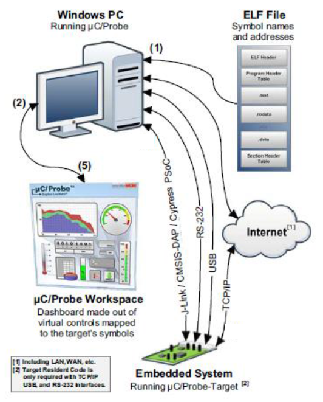

이것을 활용하는 방법은 다음과 같다.

1. ELF 파일을 읽어들인다.
    - uc/Probe 는 이 ELF 파일을 사용하여 전역변수의 이름과 번지 등을 참고하게 된다.
2. 통신방법의 설정
    - JLINK, RS-232, USB, TCP/IP 등 여러가지 통신 중에 선택
3. GUI 화면의 구성
    - Widget 목록에서 Drag-and-drop 방식으로 화면을 구성한다.
    - 필요에 따라 여러개의 화면을 구성할 수 있다.
4. 변수와 Widget 의 연결
5. uC/Probe 를 수행
    - uC/Probe 는 화면에 구성되어 있는 변수들의 정보를 통신을 통해서 요청하고 타켓프로세서에서 그 값을 읽어들여 출력하게 된다.

이 환경을 활용하는 사용예는 대표적으로 다음과 같이 구분지을 수 있다.

1. 전역변수를 Monitoring 하고 전역변수로된 파라메터를 Calibration
2. 빠르게 변화하는 신호를 오실로스코프 형태로 파형 확인
3. 데이터 로깅과 스크립트 활용(고급)

위의 대표적인 사례들을 예제를 통하여 설명하고자 한다.


## [Ex1] Monitoring & Calibration 기본

* 목적

uc/Probe 를 사용하여 중요 변수를 monitoring 하고 calibration 하는 방법을 배운다.

### 예제 프로그램

* 기본 동작
    * 시스템타이머를 사용하여 1msec 마다 인터럽트 핸들러를 수행시킨다.
    * 1 msec 마다 ticks 변수를 증가시키고, 이 값이 1000 이 되면 0으로 다시 rollover 시킨다
    * 1 초마다 g_var 변수를 증가시키고, LED1을 토글 한다.

프로젝트 ucProbe_ex1 를 import 한다.

```c
#include <DAVE.h>                 //Declarations from DAVE Code Generation (includes SFR declaration)


#define TICKS_PER_SECOND (1000U)

uint8_t g_var;

uint32_t Timer_1ms_Id;

void CB_Timer_1ms(void)
{
    static uint32_t ticks = 0;

	ticks++;

	if (ticks == TICKS_PER_SECOND)
	{
  	  	 ticks = 0;

		 DIGITAL_IO_ToggleOutput(&dhDIGITAL_OUT_0);
	  	 g_var++;
	 }
}

int main(void)
{
    DAVE_STATUS_t status;

    status = DAVE_Init();           /* Initialization of DAVE APPs  */

    if(status != DAVE_STATUS_SUCCESS)
    {
        /* Placeholder for error handler code. The while loop below can be replaced with an user error handler. */
        XMC_DEBUG("DAVE APPs initialization failed\n");
        while(1U)
        {

        }
    }

    g_var = 0;

    Timer_1ms_Id = SYSTIMER_CreateTimer(1000, SYSTIMER_MODE_PERIODIC, (void*) CB_Timer_1ms, NULL);

    SYSTIMER_StartTimer(Timer_1ms_Id);

    /* Placeholder for user application code. The while loop below can be replaced with user application code. */
    while(1U)
    {

    }
}

```

* 시스템타이머 설정
    `Timer_1ms_Id = SYSTIMER_CreateTimer(1000, SYSTIMER_MODE_PERIODIC, (void*) CB_Timer_1ms, NULL);`

    * 시스템타이머가 1KHz 로 동작하도록, 즉 1msec 마다 `CB_Timer_1ms` 인터럽트가 수행되도록 설정한다.

* 시스템타이머 시작
    `SYSTIMER_StartTimer(Timer_1ms_Id);`
* Timer_1ms 동작 시작
    
* tick 카운터 변수 관리
    * `CB_Timer_1ms()` 함수 내에서 `static uint32_t ticks = 0;` 으로 정적변수로 선언하여 카운터 값을 관리한다.
    * 핸들러의 수행시 마다 `ticks++;` 하여 1씩 증가시키고,
    * `if (ticks == TICKS_PER_SECOND)` 로 비교하여 1000번 수행되었는지, 즉 1초가 되었는지 확인하고,
    * 1초가 되었을 때 마다 `ticks = 0;`로 rollover 시킨다.

* 전역변수 g_var
    * 전역변수로 `uint8_t g_var;` 선언되어있고,
    * `g_var++; `1초마다 그 값을 1씩 증가시킨다.


### uC/Probe 의 설정

단계에서 위의 프로그램을 빌드하고 다운로드 하여 실행할 수 있도록 하여 놓는다.
다음의 uC/Probe 는 Debugger 를 사용하여 프로그램을 실행하는 경우에도 가능하고, Debugger 없이 프로그램이 다운로드 된 후에 reset 을 하여 실행되고 있는 경우에도 가능하다.
위의 예제 프로그램이 정상적으로 실행되고 있다면 LED1 이 1초 마다 토글링 하고 있을 것이다.

* uC/Probe 를 실행하고 파일을 저장한다.
    * 프로젝트 단위로 함께 관리하는 것이 용이하므로 프로젝트의 디렉토리에 프로젝트명으로 저장한다.
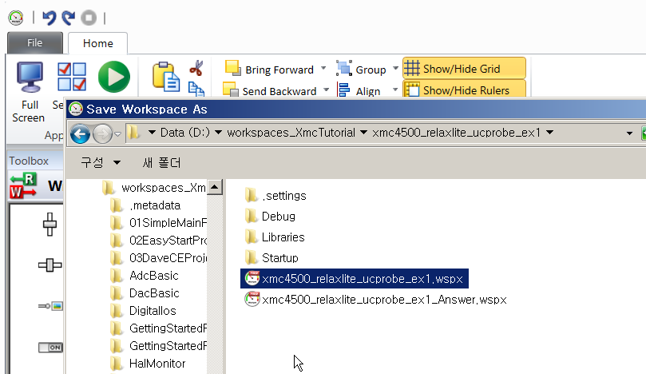

* Symbol 파일의 등록
    * 프로젝트에서 생성된 실행파일 (./Debug/xmc4500_relaxlite_ucprobe_ex1.elf) 을 등록 선택한다.
    * 만약 이 파일이 없다면 프로젝트를 빌드하여 실행파일을 만들고 다시 선택한다.

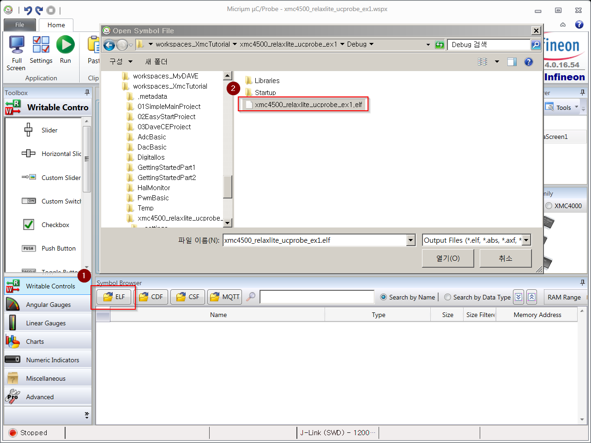

* 전역변수 등록 확인
    * Symbol Browser 를 사용하여 전역 변수 `g_var` 가 정상적으로 등록되었는지 확인한다.

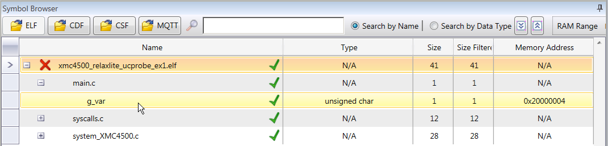

* 적합한 출력 형태 Widget 선택 및 DataScreen 구성: Monitor
    * 좌측의 Toolbox 창에서 Linear Gauges / Cylinder1 선택
    * 좌측의 Toolbox 창에서 Angular Gauges / Radial1 선택
    * Symbol Browser 창에서 g_var 를 선택하여 Cyliner 와 Radial Widget 으로 Drag&Drop
    * 각 Widget 의 Range & Color Editor 에서 Max 값을 8비트의 최대값인 255로 변경

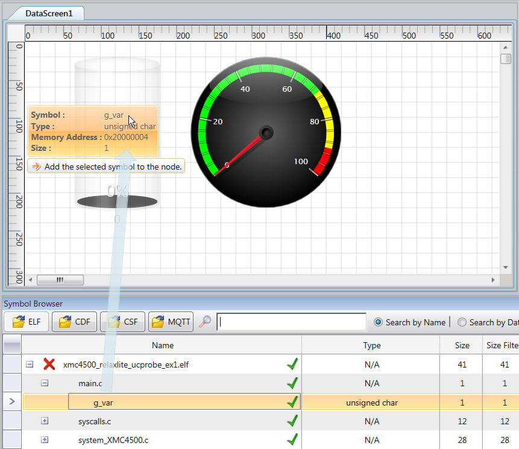

* 연결후 실시간 Monitoring 동작 확인
    * Run Button 을 선택하여 연결
    * 1초마다 각 widget 값이 1씩 증가하는지 확인

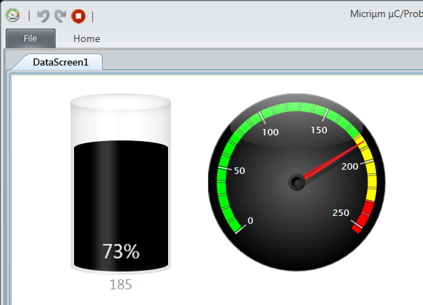

* 쓰기 가능한 Widget 선택: Calibration
    * Writable Controls / Textbox 선택
    * g_var 연결

* 연결 후 Calibration 동작 확인
    * Run Button 을 선택하여 연결
    * Textbox 를 선택하여 임의의 값으로(0~255 사이) 변경 후 확인

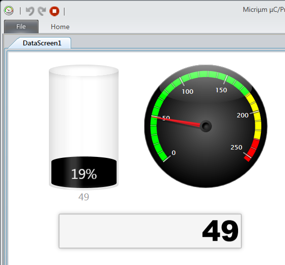

* 시간에 따른 변화 양상 확인
    * Charts / Time Based Chart 를 선택하고, g_var 연결
    * Property Editor 에서 sample time 1초로 선택
    * 연결 후 변화 확인
    * 50msec 로 Sample time 설정할 수 있으나 PC의 클락을 사용하여 데이터를 읽어들이는 것이므로 통신상황이나 PC 의 실행프로그램의 부하 등으로 이 샘플간격이 일정하지 않다.

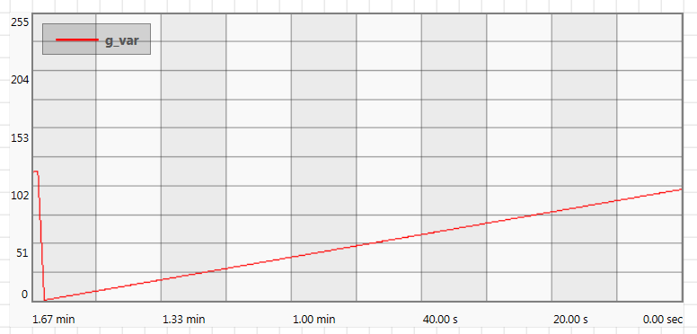

* [참고] Workspace Explorer 를 활용하여 다양한 화면 구성가능

위의 예제와 같이 전역변수를 손쉽게 Monitoring 할 수 있으며 Calibration 할 수 있다.


## [Ex2] 오실로스코프 활용

* 목적

uC/Probe의 ProbeScope 기능을 활성화하고 활용하는 방법을 배운다.

### 예제 프로그램

* 사인파, 구형파, 삼각파를 발생시키고 그 파형을 uC/Probe의 Scope 를 통해서 확인한다.
    * 2개(channel)의 파형을 생성시킨다.
    * 각 채널별로 사인파, 구형파, 삼각파를 선택할 수 있도록 한다.
    * 각 파형의 주파수(frequency), 진폭(amplitude), 오프셋(offset)을 설정할 수 있도록 한다.
    
        

프로젝트 ucProbe_ex2 를 import 한다.

```c
#include <DAVE.h>                 //Declarations from DAVE Code Generation (includes SFR declaration)
#include <probe_scope.h>

#include <math.h>

#define TICKS_PER_SECOND (1000U)
#define SECONDS_PER_TICK (1.0F / (float)TICKS_PER_SECOND)

/******************************************************************************
 * ENUMS
 *****************************************************************************/
typedef enum  CHANNEL_WAVEFORM
{
	CHANNEL_WAVEFORM_SIN = 0,
	CHANNEL_WAVEFORM_SQUARE = 1,
	CHANNEL_WAVEFORM_TRIANGLE = 2,
} CHANNEL_WAVEFORM_t;

/******************************************************************************
 * DATA STRUCTURES
 *****************************************************************************/
typedef struct channel
{
	uint32_t frequency;
	float offset;
	float amplitude;
	float radians;
	float value;
	CHANNEL_WAVEFORM_t waveform;
} channel_t;

/******************************************************************************
 * GLOBAL DATA
 *****************************************************************************/
channel_t channel_0 =
{
		.frequency = 1,
		.offset = 0.0F,
		.amplitude = 1.0F,
		.waveform = CHANNEL_WAVEFORM_SIN,
		.value = 0.0F
};

channel_t channel_1 =
{
		.frequency = 1,
		.offset = 0.0F,
		.amplitude = 1.0F,
		.waveform = CHANNEL_WAVEFORM_SQUARE,
		.value = 0.0F
};

/******************************************************************************
 * LOCAL ROUTINES
 *****************************************************************************/
void generate_channel_sample(channel_t *const channel, uint32_t ticks)
{
	float elapsed_time = 0.0F;
	int32_t tick_period = 0;
	tick_period = TICKS_PER_SECOND/channel->frequency;
	ticks = ticks % tick_period;

	switch (channel->waveform)
	{
	case CHANNEL_WAVEFORM_SIN:
		// Compute the elapsed time in decimal seconds, in floating point format.
		elapsed_time = (float)ticks * SECONDS_PER_TICK;
		// Convert the time to radians
		channel->radians = elapsed_time * 2.0F * 3.141592F * (float)channel->frequency;
		channel->value = sin(channel->radians);
		break;

	case CHANNEL_WAVEFORM_SQUARE:
		if(ticks < tick_period/2){
			channel->value = -1.0;
		}
		else{
			channel->value = 1.0;
		}
		break;

	case CHANNEL_WAVEFORM_TRIANGLE:
		if(ticks < tick_period/2){
			channel->value = -1.0 + 4.0* (float)ticks/(float)tick_period;
		}
		else{
			channel->value = 3.0 - 4.0* (float)ticks/(float)tick_period;
		}
		break;

	default:
		break;
	}

	channel->value *= channel->amplitude * 0.5F;
	channel->value += channel->offset;
}

uint8_t g_var;

uint32_t Timer_1ms_Id;

void CB_Timer_1ms(void)
{
	static uint32_t ticks = 0;

	ticks++;

	if (ticks == TICKS_PER_SECOND)
	{
		ticks = 0;

		DIGITAL_IO_ToggleOutput(&dhDIGITAL_OUT_0);
		g_var++;
	}
	generate_channel_sample(&channel_0, ticks);
	generate_channel_sample(&channel_1, ticks);

	/* Take a sample of the active oscilloscope channels */
	ProbeScope_Sampling();

}

int main(void)
{
	DAVE_STATUS_t status;

	status = DAVE_Init();           /* Initialization of DAVE APPs  */

	if(status != DAVE_STATUS_SUCCESS)
	{
		/* Placeholder for error handler code. The while loop below can be replaced with an user error handler. */
		XMC_DEBUG("DAVE APPs initialization failed\n");

		while(1U)
		{

		}
	}

	g_var = 0;

	/* Initialize ProbeScope */
	ProbeScope_Init(SystemCoreClock / TICKS_PER_SECOND);

	Timer_1ms_Id = SYSTIMER_CreateTimer(1000, SYSTIMER_MODE_PERIODIC, (void*) CB_Timer_1ms, NULL);
	SYSTIMER_StartTimer(Timer_1ms_Id);

	/* Placeholder for user application code. The while loop below can be replaced with user application code. */
	while(1U)
	{

	}
}

```

* `channel_t` 자료구조
    * 주파수, 오프셋, 진폭, 파형의 종류 등의 사용자 설정 정보와
    * 라디안, 순시치 등의 파형 생성에 필요한 정보를 모아서 관리

* `generate_channel_sample(channel_t * const channel, uint32_t ticks)` 함수
    * 현재의 `ticks` 값으로 각도 `channel->radians` 계산
    * 파형의 종류에 따라 `channel->value` 계산


### uC/Probe 설정

1. Download Micrium Probe Target Code
    * uC/Probe 프로그램를 설치하면 PC 에서 수행하는 부분과 타겟에서 수행하는 부분이 각각 uC-Probe XMC 라는 디렉토리와 uC-Probe_etc 라는 디렉토리에 설치된다.
    * 만약 타겟에서 수행하는 부분이 설치되지 않았다면 micrium 홈페이지에서 다음과 같이 개별적으로 설치할 수 있다.() https://www.micrium.com/tools/ucprobe/software-and-docs/)
    * 정상적으로 설치되었다면 다음과 같이
        * Communication/Scope/ 디렉토리에 `probe_scope.c`, `probe_scope.h` 파일이 존재하고
        * Communication/Scope/cfg 디렉토리에 `probe_scope_cfg.h` 파일이 존재한다.
        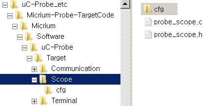
1. Scope code 포함
    * 위의 세개의 파일을 프로젝트에 포함시켜야 한다.
        * scope 라이브러리 파일: `probe_scope.c`, `probe_scope.h`
        * scope 설정 파일: `probe_scope_cfg.h`
    * 세개의 파일을 복사하여 프로젝트에 포함시킨다.   
    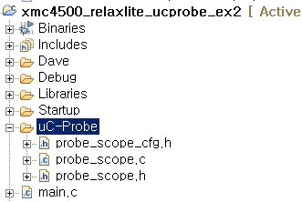
    * 파일이 존재하는 디렉토리를 include 한다.  
    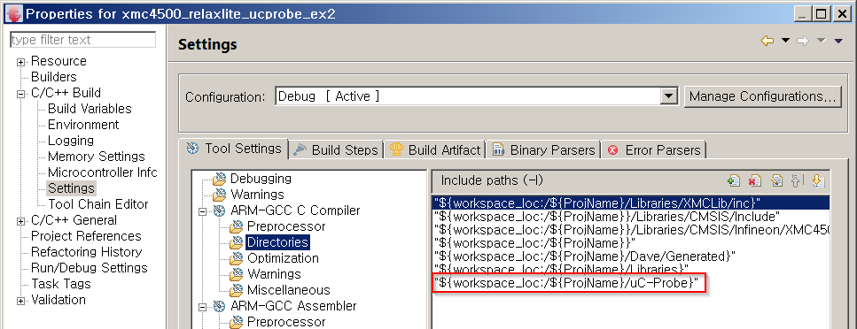

1. Configure Scope

`probe_scope_cfg.h` 파일의 내용을 수정하여 scope 를 설정한다.

```
/*******************************************************************************
*                                 CONFIGURATION
******************************************************************************/

#define  PROBE_SCOPE_MAX_CH                       8    /* The maximum number of channels: [1,8].                      */
#define  PROBE_SCOPE_MAX_SAMPLES               1000    /* The maximum number of samples per channel.                  */
#define  PROBE_SCOPE_16_BIT_EN                    1    /* The maximum size of each sample is 16-bits: [0,1].          */
#define  PROBE_SCOPE_32_BIT_EN                    1    /* The maximum size of each sample is 32-bits: [0,1].          */

```

1. Scope code 초기화 및 주기적 호출

    * header 파일 include
    * scope 라이브러리 초기화
    main 함수에서 다음 함수를 호출하여 scope 라이브러리를 초기화 한다.
    * scope 라이브러리 주기적 호출 수행
    주기적인 샘플링을 위하여 다음의 함수를 주기적인 함수에서 호출하도록 한다. 이 함수가 호출되면서 샘플링한 데이터들을 저장하게 된다.
```
#include <probe_scope.h>
```

```
/* Initialize ProbeScope */
 ProbeScope_Init(SystemCoreClock / TICKS_PER_SECOND);
```

```
/* Take a sample of the active oscilloscope channels */
ProbeScope_Sampling();
```

1. uC/Probe Oscilloscope 사용

    * Oscilloscope screen 추가  
    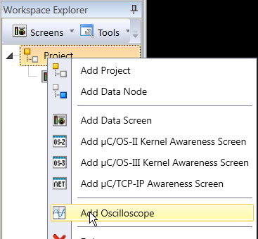

    * Symbole Browser 에서 모니터링 하고 싶은 변수 연결
        * channel_0->variable과 channel_1->variable 변수를 연결  
    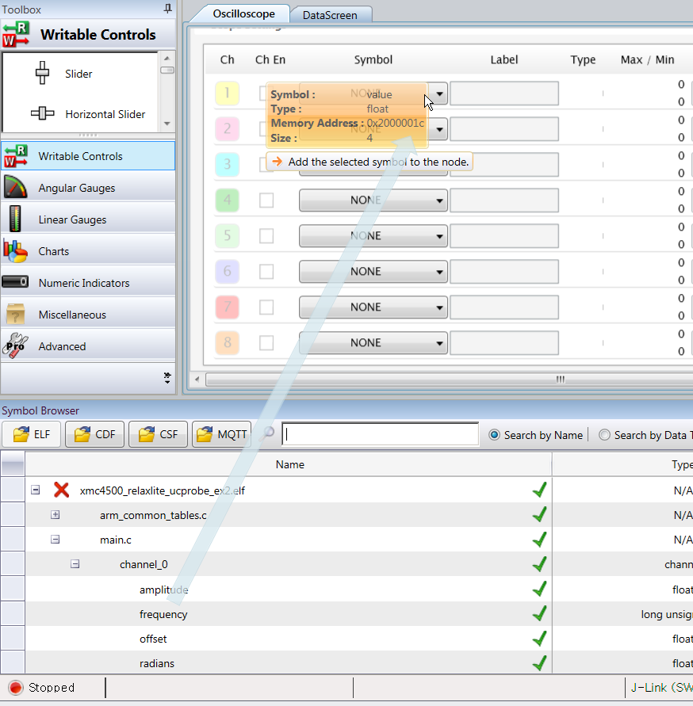

    * Scope screen을 사용하여 변수값 확인
        * 출력의 범위 등을 확인할 수 있다.
        * trigger 조건등을 설정할 수 있다.  
    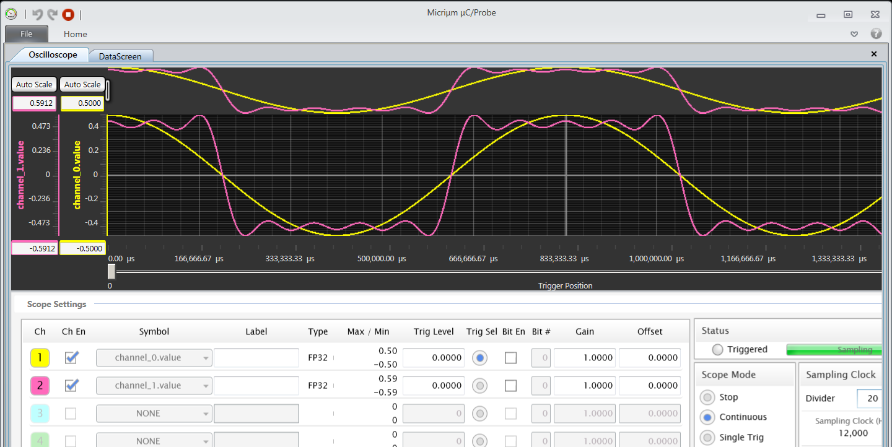


## [Ex3] Data 로깅과 스크립트 활용 (고급)

* 목적

후처리 작업 (Post Processing)을 위하여 Data를 로깅하는 방법과, 일련의 작업을 자동화 하는 Script의 활용법을 배운다.

### 예제 프로그램

ex2 에서 사용하였던 예제를 같이 활용한다.

### uC/Probe 설정

* DataLogger 설정
    * CSV 파일 포맷으로 데이터를 저장할 수 있다.
    * Symbol Browser 에서 Darg & Drop 으로 변수를 연결한다.
    * Sampling rate 를 조정할 수 있지만 통신 속도와 통신 자료의 양에 따라 가변적이다. (수백 msec 이상의 주기를 설정하여야 한다)

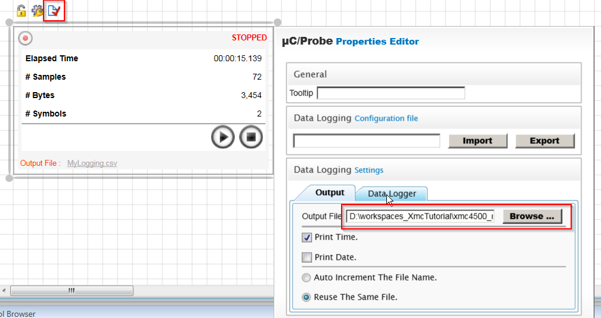

* Script 설정
    * 동작해야 하는 코드를 스크립트로 구성하여서 수행시킬 수 있다.
    * 반복적으로 같은 동작을 수행해야 하는 경우 매우 유용하게 사용할 수 있다.
    * Scripting Control을 선택하고 Script 파일을 연결한다. (MyScript.cfg)

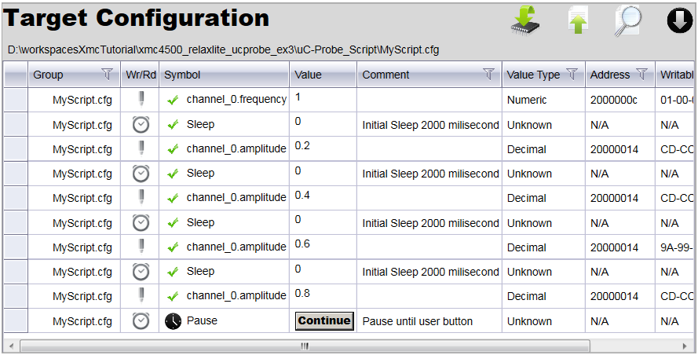

```
$channel_0.frequency = 1;

for(int i = 1; i<5; i++){

    Sleep("Initial Sleep 2000 milisecond", 2000);

    $channel_0.amplitude = 0.2 * i;
}

Pause("Pause until user button");
```

  * scipt 파일의 구체적인 문법은 매뉴얼을 참고하도록 한다.

